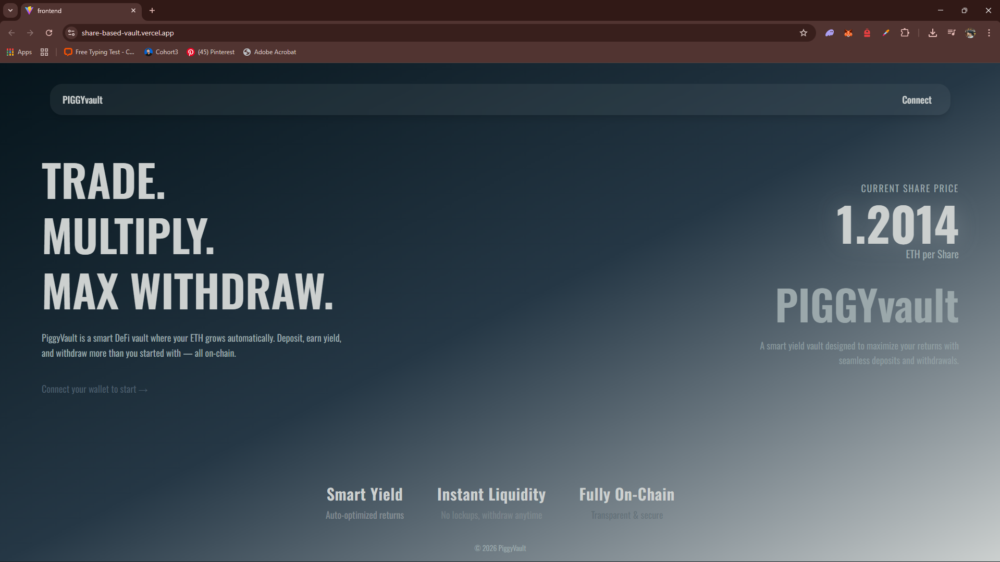
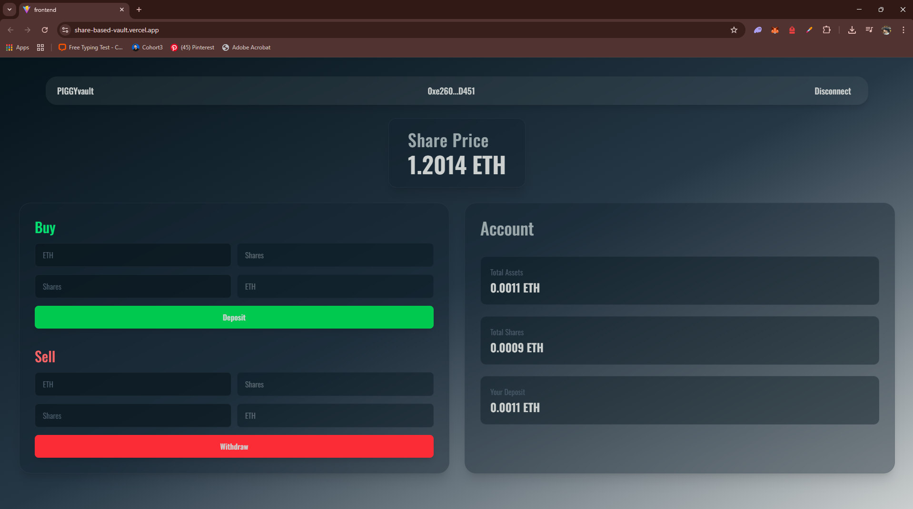
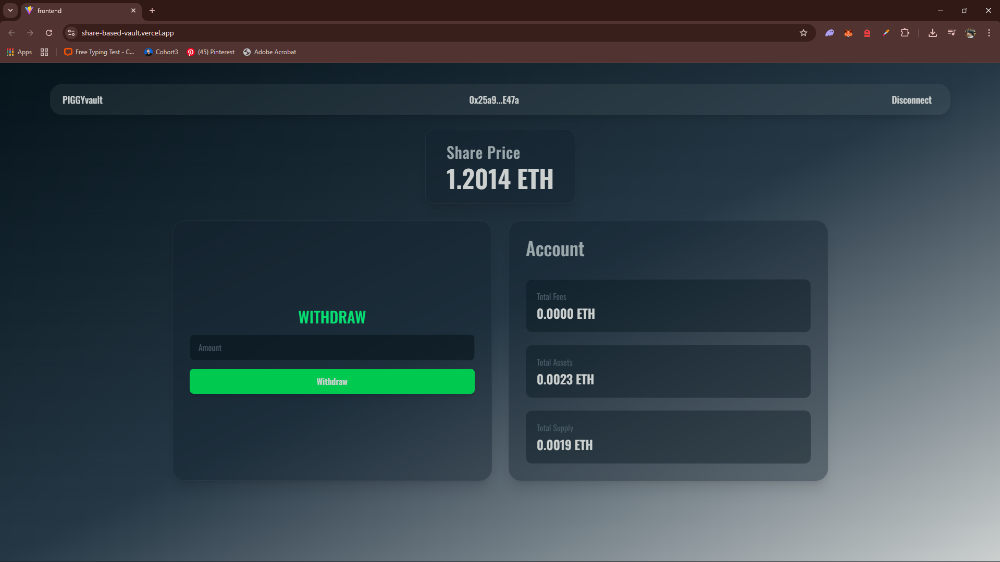

# 🏦 ETH Vault DApp

A decentralized ETH vault where users can deposit ETH and receive shares, and withdraw their assets with a small fee. Built with Solidity, Wagmi, and React.

---

## 🔗 Live Demo

👉 Frontend: https://share-based-vault.vercel.app

👉 Contract (Sepolia): https://sepolia.etherscan.io/address/0x66BC1259b302f1FC46990bfBB665609f41A66e3b

---

## 📸 Screenshots

### 🖥️ Landing Page

### 💱 User Dashboard

### 👑 Owner Dashboard

---

## 🚀 Features

- Deposit ETH and receive vault shares (ERC20)
- Withdraw ETH by burning shares
- Real-time share price calculation
- Preview deposit/withdraw amounts
- Owner dashboard to collect fees
- Fully responsive UI with loading & error handling

---

## 🧠 How It Works

- Users deposit ETH → receive proportional shares
- Vault tracks:
  - Total Assets
  - Total Supply (shares)
- Share Price = `totalAssets / totalSupply`
- Withdrawals include a **1% fee**
- Fees are collected and claimable by the owner

---

## 📈 Yield & Share Price Mechanics

The vault is designed to increase share price over time, benefiting all share holders — even without explicit yield strategies.

### How Share Price Increases

The vault can gain ETH via:

- Withdrawal fees
- Direct ETH transfers
- Force-sent ETH (selfdestruct)
- Future yield strategies

Since:__
sharePrice = totalAssets / totalSupply__

Any increase in assets → higher share price

### Fee-Based Yield

- 1% fee on withdrawals
- Stored in feeBalance
- Not included in totalAssets

### Future Yield Opportunities

Planned extensions:

- Lending / borrowing
- Interest-based yield
- DeFi integrations

Result:

- Increased totalAssets
- Higher share price
- Passive gains for users

### Key Insight

Users don’t get paid yield directly.__
Their shares become more valuable over time.

---

## 🏗️ Project Structure

project-root/__
│__
├── contract/ → Solidity smart contract__
├── frontend/ → React + Wagmi frontend__
│__
└── README.md__

---

## 🛠️ Tech Stack

- Solidity (Smart Contracts)
- OpenZeppelin
- React + TypeScript
- Wagmi + Viem
- TailwindCSS
- Vercel (Deployment)

---

## ⚙️ Setup

### 1. Clone repo

git clone <https://github.com/SalongDb/share-based-Vault>__
cd project-root

### 2. Install dependencies

### Frontend:
cd frontend__
npm install

### Contract:
cd contract__
npm install

---

## 🌐 Deployment

- Smart Contract → Sepolia Testnet
- Frontend → Vercel

---

## 📄 License
MIT